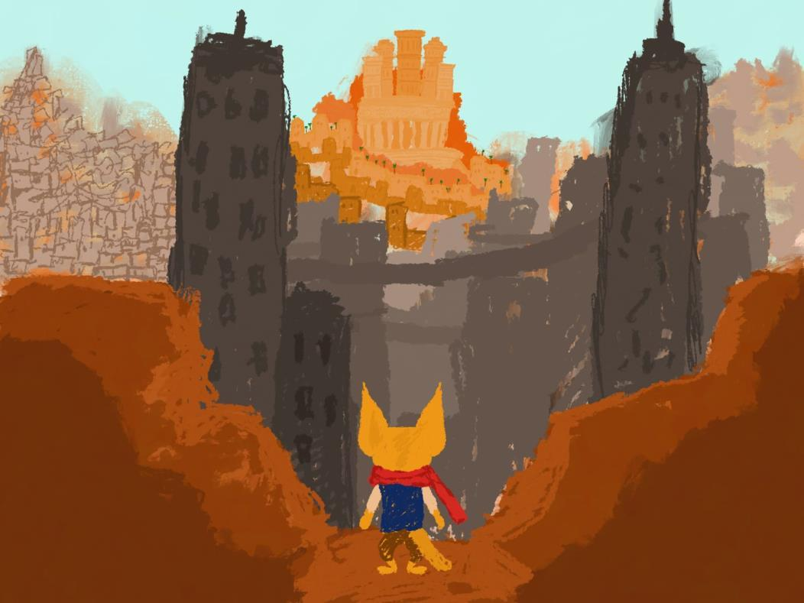
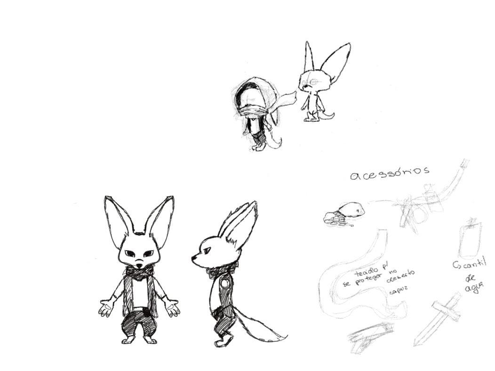
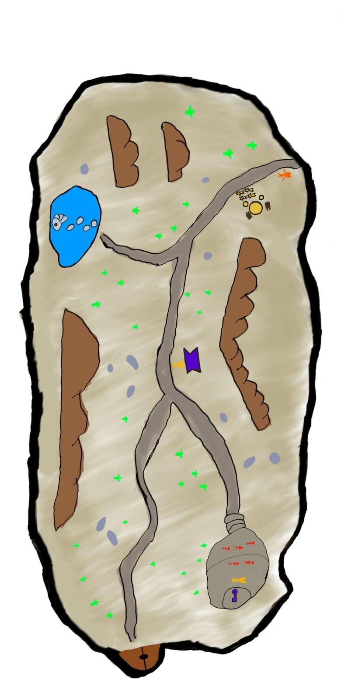

# Feneco — Third-Person Action RPG (Unity)

> Play as a fennec fox on a journey to save your desert community from water scarcity — a third-person action RPG with exploration, quests, lock-on combat, and equipment progression.

**Engine:** Unity 6 (6000.3.15f1) · Universal Render Pipeline · New Input System · Cinemachine  
**Platform:** Windows  
**Context:** Team project for Axes (Eixos) 3 & 4 of the Digital Games program at PUC Minas  
**Original team repository:** [SauloSouza27/Feneco](https://github.com/SauloSouza27/Feneco)

> **Note on repo history:** this repository is a portfolio snapshot of our academic team project. It preserves the full commit history, so every teammate's authorship is intact. The **My contributions** section below describes my direct work only.

---

## About the game

*Feneco* is a fantasy adventure in which the player takes the role of a desert fox trying to save its community from an imminent water shortage. Journeying through the Great Desert City — a world inhabited by humanoid animals — the character uncovers ancient secrets and forges unexpected alliances.

Gameplay pillars (from our Game Design Review):

- Open-map exploration with NPCs, quests, and enemies
- Combat using special abilities, with dodge-based defense
- Progression by upgrading equipment and weapons earned through quests and defeated enemies

The playable vertical slice contains the main menu, the desert level (*Fase 1*), and credits.

---

## Media

| Character concept | Level 1 design map |
|---|---|
|  |  |

<!-- TODO: add gameplay screenshots / GIFs to docs/media and embed them here:

-->

---

## My contributions (Gameplay / Engineering)

My focus was the third-person action foundation — character control, combat, and enemy AI:

- **Player state machine** — free-look locomotion, target-lock movement, jumping, falling, ledge hanging, and attacking as discrete states with clean transitions
- **Enemy AI state machine** — idle, patrol, chase, attack, impact reaction, and death states
- **Lock-on targeting system** — `Targeter`/`Target` components for acquiring and cycling combat targets
- **Combat support** — health, weapon damage windows, knockback via a `ForceReceiver`, and ragdoll death reactions
- **Ledge detection** for climb/hang traversal
- **Input handling** with Unity's New Input System (`InputReader`)
- **Inventory prototype** — slot-based inventory with items, equipment slots (helmet/armor/weapon), and consumables

Other systems in the shipped slice (enemy FSM integration, escort NPC, menus, audio, VFX, art) were built by my teammates — see [Team](#team).

---

## Controls

**Keyboard & Mouse** — Move: `WASD` / arrows · Camera: mouse · Attack: `LMB` / `RMB` · Jump: `Space` · Dash: `Left Shift` · Interact: `E` · Inventory: `I` / `Tab` · Menu: `Esc`  
**Gamepad** — supported (sticks + triggers)

---

## How to run

1. Clone the repository
2. Open the project with **Unity 6000.3.15f1** (or a newer Unity 6 release)
3. Open the scene `Assets/__Feneco/Scenes/MenuPrincipal.unity` and press Play

---

## Design documents

The full Game Design Review documents (in Portuguese) are included:

- [GDR — Etapa 2](Documents/GDR%20Feneco%20-%20Etapa%202.pdf)
- [GDR — Etapa 3](Documents/GDR%20Feneco%20-%20Etapa%203.pdf)
- [GDR — Etapa 4](Documents/GDR%20Feneco%20-%20Etapa%204.pdf)

---

## Team

Academic team project — Digital Games, PUC Minas:

- Saulo Souza — [@SauloSouza27](https://github.com/SauloSouza27)
- Maria Fernanda Silva — [ArtStation](https://www.artstation.com/fernanda828)
- Paulo Antônio — [@Tiofly](https://github.com/Tiofly)
- Guilherme Oliveira — [@megatruckp](https://github.com/megatruckp)
- Lucca Oliveira
- Fabrício Frade — [@FFrade22](https://github.com/FFrade22)
- Ian Barbosa — [@Ian-WB](https://github.com/Ian-WB)

*(Also contributing on GitHub: [@toezin05](https://github.com/toezin05).)*

---

## License

Code is licensed under **Apache-2.0** (see [LICENSE](LICENSE)). Art, audio, and design assets belong to their respective authors — please contact the team before reusing them.

## Contact

- GitHub: [Ian-WB](https://github.com/Ian-WB)
